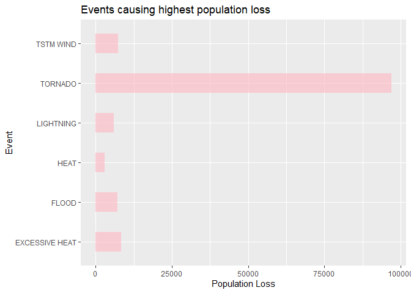
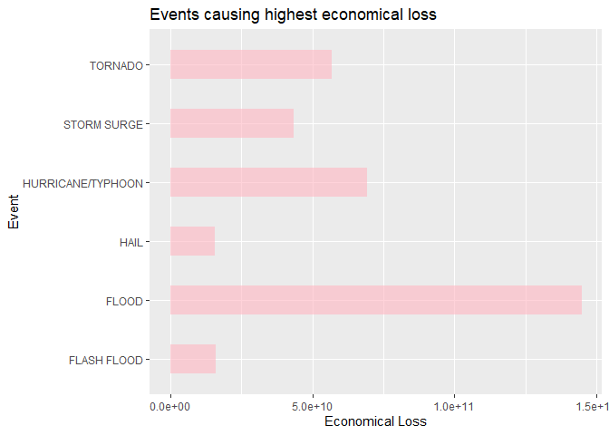

Storms and other severe weather events can cause both public health and economic problems for communities and municipalities. Many severe events can result in fatalities, injuries, and property damage, and preventing such outcomes to the extent possible is a key concern.

This project involves exploring the U.S. National Oceanic and Atmospheric Administration's (NOAA) storm database. This database tracks characteristics of major storms and weather events in the United States, including when and where they occur, as well as estimates of any fatalities, injuries, and property damage.

## Data Download

```r
library(ggplot2)
```

```
## Warning: package 'ggplot2' was built under R version 4.0.2
```

```r
library(dplyr)
```

```r
#Downloading the data
file <- download.file("https://d396qusza40orc.cloudfront.net/repdata%2Fdata%2FStormData.csv.bz2","zippedfile.bz2")
stormdata <- read.csv("zippedfile.bz2")
```

## Data Processing - Population Health

To find which event causes the most harmful with respect to population health, the fatalities and injuries related to each event was considered.


```r
data_health <- stormdata[,c(8,23,24)] #Selecting only relevant columns
data_health <- mutate(data_health,loss=FATALITIES+INJURIES) #Adding the fatalities and injuries
data_health <- aggregate(loss ~ EVTYPE, data_health,sum,na.rm=TRUE) #Adding the losses for each event
data_health[sample(1:nrow(data_health),10),]
```

```
##                      EVTYPE loss
## 422    Ice jam flood (minor    0
## 678            Strong winds    0
## 812 THUNDERSTORM WINDS/HAIL    1
## 37       BLIZZARD/HIGH WIND    0
## 221                   Glaze    0
## 291    HEAVY RAIN AND FLOOD    0
## 749     THUNDEERSTORM WINDS    0
## 927      Volcanic Ash Plume    0
## 795   THUNDERSTORM WINDS 62    0
## 814    THUNDERSTORM WINDS53    0
```

```r
data_health <- arrange(data_health,-loss) #Rearranging the data according to loss (In descending order)
colnames(data_health) <- c("Event","Loss")
```

Above, the data to find which event causes the most harmful with respect to population health is processed.

## Result - Population Health

The 6 events which cause the most harm to population health is shown below: 

```r
h <- ggplot(data_health[1:6,],aes(x=Loss,y=Event))
h <- h + geom_bar(stat="identity", fill="#FFB6C1", alpha=0.6, width=0.5)
h <- h + labs(x="Population Loss",y="Event",title="Events causing highest population loss")
h
```

<!-- -->

### As we can see above, Tornadoes cause the most harm to population health.

## Data Processing - Economic Consequences

To find types of events have the greatest economic consequences. The economic consequences can be divided into 2 parts, Property Damage and Crop Damage.

First, the economic damages to property and crops are calculated seperately, after processing the exponents. Then they are added according to events.

```r
dataprop <- stormdata[,c(8,25,26)] #Columns related to property damages
dataprop[sample(1:nrow(dataprop),10),]
```

```
##                    EVTYPE PROPDMG PROPDMGEXP
## 836291               HAIL       0          K
## 453123          TSTM WIND      15          K
## 211567 THUNDERSTORM WINDS       1          K
## 806195  THUNDERSTORM WIND       4          K
## 105561          TSTM WIND       0           
## 81929             TORNADO      25          K
## 614852          TSTM WIND       0           
## 819416               HAIL       0          K
## 519421          LIGHTNING     400          K
## 165774          TSTM WIND       0
```

```r
datacrop <- stormdata[,c(8,27,28)] #Columns related to crop damages
datacrop[sample(1:nrow(datacrop),10),]
```

```
##                  EVTYPE CROPDMG CROPDMGEXP
## 517863             HAIL       0           
## 807330             HAIL       0          K
## 602172 MARINE TSTM WIND       0           
## 477470             HAIL       0           
## 851409     FUNNEL CLOUD       0          K
## 437073        TSTM WIND       0           
## 885284             HAIL       0          K
## 51876              HAIL       0           
## 434714       HEAVY SNOW       0           
## 5561          TSTM WIND       0
```

To make sense of the exponents provided, we have to make a separate dataframe of the symbols and their meaning.

```r
m <- c(0,0,0,1,10,10,10,10,10,10,10,10,10,10^9,10^2,10^2,10^3,10^6,10^6)
symbol <- sort(unique(stormdata$PROPDMGEXP))
multiply <- data.frame(cbind(symbol,m)) 
multiply$m <- as.numeric(multiply$m)
multiply
```

```
##    symbol     m
## 1         0e+00
## 2       - 0e+00
## 3       ? 0e+00
## 4       + 1e+00
## 5       0 1e+01
## 6       1 1e+01
## 7       2 1e+01
## 8       3 1e+01
## 9       4 1e+01
## 10      5 1e+01
## 11      6 1e+01
## 12      7 1e+01
## 13      8 1e+01
## 14      B 1e+09
## 15      h 1e+02
## 16      H 1e+02
## 17      K 1e+03
## 18      m 1e+06
## 19      M 1e+06
```

This dataframe has to be used to make sense of the exponents and find the actual damage value.

### Property Damages

```r
colnames(dataprop)[3] <- "symbol"
dataprop <- merge(dataprop,multiply,by="symbol") #Merge to match the exponent symbols
dataprop <- mutate(dataprop,PROPDMG=PROPDMG*m) #Multiply the damage with the exponent value
dataprop <- dataprop[,2:3] #Sub-setting to get only required columns
dataprop <- aggregate(PROPDMG~EVTYPE,data=dataprop,sum) #Summation of damages based on event
```

### Crop Damages

```r
colnames(datacrop)[3] <- "symbol"
datacrop <- merge(datacrop,multiply,by="symbol") #Merge to match the exponent symbols
datacrop <- mutate(datacrop,CROPDMG=CROPDMG*m) #Multiply the damage with the exponent value
datacrop <- datacrop[,2:3] #Sub-setting to get only required columns
datacrop <- aggregate(CROPDMG~EVTYPE,data=datacrop,sum) #Summation of damages based on event
```

Now, we have to add the economic and crop damages.

```r
dataeco <- merge(dataprop,datacrop,by="EVTYPE") 
dataeco <- mutate(dataeco,loss=CROPDMG+PROPDMG)
dataeco <- arrange(dataeco,-loss)
colnames(dataeco) <- c("Event","Loss")
```

Above, the data to find which event causes the most economic consequence is processed.

## Result - Economic Consequence

The 6 events which cause the most economic consequences are:

```r
h <- ggplot(dataeco[1:6,],aes(x=Loss,y=Event))
h <- h + geom_bar(stat="identity", fill="#FFB6C1", alpha=0.6, width=0.5)
h <- h + labs(x="Economical Loss",y="Event",title="Events causing highest economical loss")
h
```

<!-- -->

### As we can see above, Floods cause the most economic consequence.

